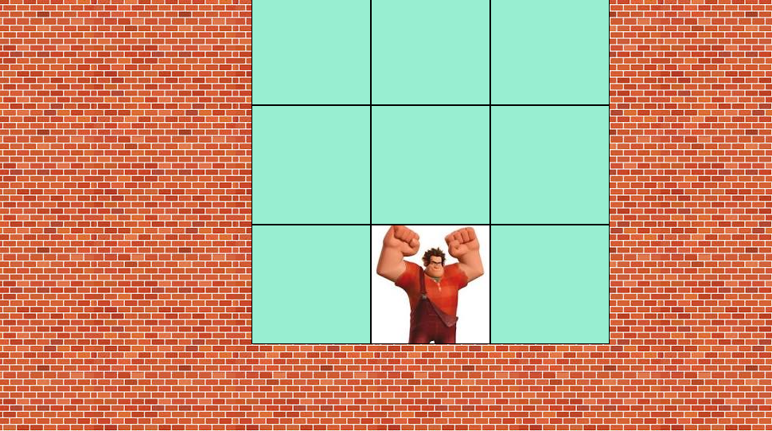

# 🎮 Mini-Game Detona Ralph




## 📝 Descrição

Este é um mini-jogo divertido no estilo "Whac-a-Mole", criado com HTML, CSS e JavaScript puro, e inspirado no universo do filme "Detona Ralph". O objetivo do jogador é clicar no personagem Ralph o maior número de vezes possível antes que o tempo acabe, tomando cuidado para não errar e perder suas vidas.

## ✨ Funcionalidades

-   [x] **Grade 3x3 Interativa:** O jogo se desenrola em uma grade onde o inimigo aparece aleatoriamente.
-   [x] **Contagem de Pontos:** Cada acerto no Ralph aumenta a pontuação do jogador.
-   [x] **Temporizador Regressivo:** O jogador tem 60 segundos para marcar o máximo de pontos.
-   [x] **Sistema de Vidas:** O jogador começa com 3 vidas e perde uma a cada clique errado.
-   [x] **Tela de "Game Over":** Ao final do tempo ou ao perder todas as vidas, uma tela exibe a pontuação final.
-   [x] **Botão para Jogar Novamente:** Permite reiniciar o jogo sem precisar recarregar a página.
-   [x] **Efeitos Sonoros:** Sons para acertos e erros, melhorando a experiência do usuário.

## 🛠️ Tecnologias Utilizadas

As seguintes tecnologias foram usadas na construção do projeto:

-   **HTML5:** Para a estrutura e os elementos da página.
-   **CSS3:** Para a estilização, layout (Flexbox) e animações.
-   **JavaScript (Vanilla):** Para toda a lógica do jogo, manipulação do DOM e interatividade.

## 🕹️ Como Jogar

1.  Clone este repositório para a sua máquina local.
2.  Abra o arquivo `index.html` em qualquer navegador de internet moderno (Google Chrome, Firefox, etc.).
3.  O jogo começará automaticamente!
4.  Use o mouse para clicar nos quadrados onde o personagem Ralph aparecer.
5.  Tente fazer o máximo de pontos antes que o tempo ou suas vidas acabem!

## 📂 Estrutura de Arquivos

O projeto está organizado da seguinte forma:

```
.
├── index.html
├── README.md
└── src/
    ├── scripts/
    │   └── engine.js
    ├── styles/
    │   ├── main.css
    │   └── reset.css
    ├── images/
    │   ├── .jpeg
    │   ├── .jpeg
    │   └── .png
    └── audios/
        ├── hit.m4a
        └── miss.m4a
```

## 🚀 Melhorias Futuras

Aqui estão algumas ideias para futuras versões do projeto:

-   [ ] Adicionar diferentes níveis de dificuldade.
-   [ ] Salvar recordes (High Scores) no `LocalStorage` do navegador.
-   [ ] Adicionar novas animações e efeitos visuais.
-   [ ] Tornar o design totalmente responsivo para dispositivos móveis.

## 👨‍💻 Autor

Feito por **Gelson Bario**.

-   **LinkedIn:** `www.linkedin.com/in/gelsonbario`
-   **GitHub:** `https://github.com/GelsonBario`